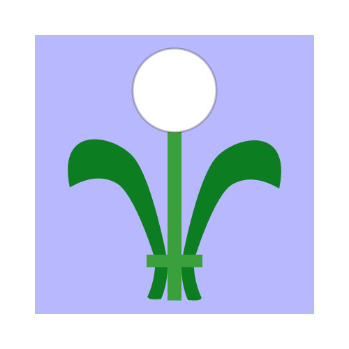

  

  <h1>UniGUI</h1>

  

    <strong>Flexible GUI library in Rust</strong>
  

  

    
    
    
  

  <h4>
    <a href="http://example.com/">A link</a>
     | 
    <a href="http://example.com/">Another link</a>
     | 
    <a href="http://example.com/">A third link</a>
     | 
    <a href="http://example.com/">One last link</a>
  </h4>

UniGUI is a flexible GUI library for Rust.  
It provides a fast HTML-like layout engine, and both low and high level 2D rendering methods.

Low level tools are believed crucial, since they have been omitted in alternatives which leads to many cases where these libraries are not powerful enough to cover specific needs. UniGUI aims to fill this gap, while also providing higher level tools.

## Features

- Fast HTML-like **layout** engine
- **Flexboxes**
- Widget size negociation with container
- **Responsive** widget positioning
- [Yew](https://github.com/yewstack/yew)-like **retained mode**, but widgets can update their size and data at any time
- **Cross platform** rendering (thanks [wgpu](https://github.com/gfx-rs/wgpu)!)
- **Text rendering** (thanks [glyph_brush](https://github.com/alexheretic/glyph-brush)!)
- **Image rendering**
- **Vertex rendering**
- Shapes rendering via **tesselation** (TODO)

## Example

TODO

## Design

TODO

## Roadmap

- Anti Aliased Tesselation

## Goals

Goals in common with most alternatives:
- Simple and easy to use
- Responsive and fast
- Portable (based on wgpu)

Goals in opposition with most alternatives:
- Provide low level tools
- Allow users to define their own containers, so that they can positionate widgets as they wish

## Non-goals

- Built-in widgets: we have libraries for that, UniGUI is just the core of the modular ecosystem
- No-unsafe fanatism: we will use unsafe to speed up things wherever possible, as long as we can prove it is actually safe

## Alternatives

TODO
